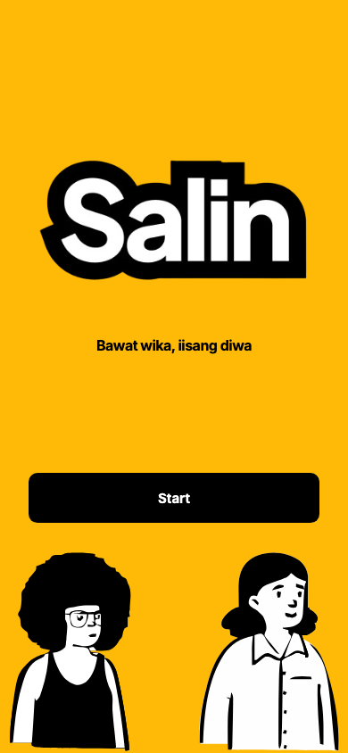
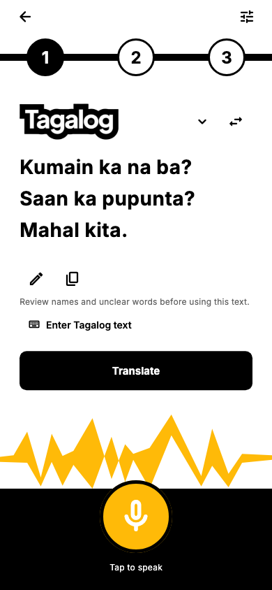
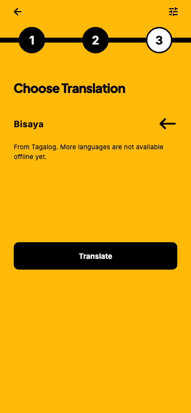
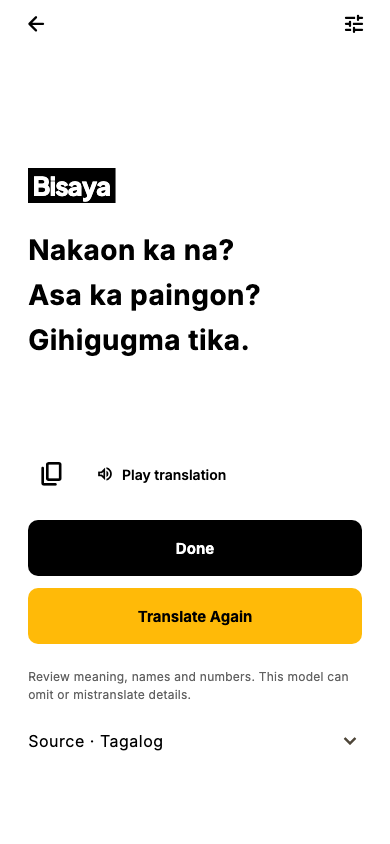

# Salin UI implementation — 10 October 2026

The supplied four-frame board is implemented in the existing Flutter app.
The audited baseline was clean `main` at `fc3cc9f feat: bisaya translation`.
No speech services, translation controllers, audio algorithms, language mappings,
native code or platform configuration were changed. No commit or push was made.

## Screens and source files

| File | Change |
|---|---|
| `lib/main.dart` | Salin branding, centralized theme, landing entry point; existing `SultiApp` class remains compatible. |
| `lib/theme/salin_theme.dart` | Yellow `#FFBA08`, black and white theme; Plus Jakarta Sans headings, Inter body/controls; shared buttons/fields. |
| `lib/features/speech/presentation/salin_landing_screen.dart` | Original logo, tagline, Start, responsive left/right character SVGs. |
| `lib/features/speech/presentation/salin_components.dart` | Numbered steps, language heading, padding-aware Tagalog PNG, decorative waveform. |
| `lib/features/speech/presentation/speech_home_screen.dart` | Capture, language choice, translation result and settings views wired to the existing state and callbacks. |
| `lib/features/speech/presentation/live_caption_card.dart` | Colors updated; caption following/scrolling and recognition behavior retained. |
| `pubspec.yaml`, `pubspec.lock` | Exact asset registration, local font registration and `flutter_svg` 2.3.0. |
| `test/widget_test.dart`, `test/translation_screen_test.dart` | Existing behavior checks updated to navigate the new UI. |
| `test/salin_layout_test.dart` | Small/large/landscape layouts, enlarged text, stale-result reset and optional rendered screenshots. |
| `README.md`, `assets/README.md`, `evaluation/salin-ui-implementation.md` | Updated navigation instructions, asset provenance and this verification report. |

Start opens capture. Existing source-language selection and swap are next to the
header. Finish still sends only finalized speech to the existing automatic
translator. Capture → Translate → language choice → Translate opens that job or
result, without duplicating it. Typed/edited source starts translation at the
second Translate button. Results retain copy, playback, unavailable-voice notices,
retry and source review/editing. Translate Again clears the session; Done returns
to the landing route. Recording/recognition cannot be abandoned accidentally by
back navigation; their explicit cancel controls remain available.

Settings preserves recognition-only English/auto, live captions, optional noise
suppression, Base refinement, Cebuano/mixed speech, model import/download,
translation installation/progress/errors, raw edited transcript inspection and
privacy information. Setup is still explicit; no model downloads start on launch.

## Artwork and typography

- `LANDPAGElogo.png`: unchanged landing logo, `Image.asset`, explicit aspect ratio
  and `BoxFit.contain` to avoid layout shifts while it decodes.
- `AFRO.svg`: bottom-left landing illustration via `SvgPicture.asset`.
- `BABAE.svg`: bottom-right landing illustration via `SvgPicture.asset`.
- `tagalogHeader.png`: unchanged source header (and Tagalog target header in the
  reverse direction). Its visible bounds were measured as (38,70)–(396,200) in
  the original 433×240 file. Layout clips transparent padding only.
- Inter and Plus Jakarta Sans variable TTFs are local assets with OFL licenses.
  Font axes were inspected: Inter has weight 100–900 and optical size 14–32;
  Plus Jakarta Sans has weight 200–800. Screenshots load these actual fonts.

**User-approved change to the original brief:** only JPEG character files were
provided. The user explicitly requested SVG conversion. Both SVGs are vector
tracings of those JPEGs, with transparent exterior backgrounds and white clothing;
the JPEG and PNG originals remain untouched. See [asset provenance](../assets/README.md).
They contain only paths/transforms and simple fills, with no external references
or unsupported complex SVG features. `flutter_svg` is the only new direct runtime
package; existing Whisper dependencies remain unchanged. Its small vector/XML
transitive dependencies are recorded in the lockfile. No Google Fonts runtime
package or network font fetching was introduced.

## Actual checks

| Check | Result |
|---|---|
| `flutter pub get` | Passed. Existing unrelated versions were retained. |
| `dart format lib test` | Passed. |
| `flutter analyze` | Passed, no issues. |
| `flutter test --dart-define=SALIN_SCREENSHOTS=true` | 35 tests passed, including all existing service/controller tests. |
| `flutter build apk --debug --target-platform android-arm64` | Passed; `build/app/outputs/flutter-apk/app-debug.apk`. |
| `git diff --check` | Passed. |
| APK asset contents | All four artwork files and both font files verified byte-for-byte against the project assets. |
| SVG/PNG visual inspection | Passed using actual Flutter test-rendered screens; both characters, logo and Tagalog header are visible. |
| Physical-device launch, real microphone, inference, offline TTS/airplane mode | Not run in this session. Device-detection cache-access approval was declined; widget tests use injected speech/translation/voice test doubles. |
| iOS, desktop and web deployment | Not tested; no new platform support is claimed. |

Initial runs exposed old UI-test expectations, a nested selectable-text/expansion
scroll-state collision and navigation being disabled during model discovery. All
were corrected before the passing run. The first tracing tool's Python 3.14 build
crashed; conversion succeeded with its Python 3.12 build. No pre-existing failing
tests remain in the final Flutter run.

Layout checks used logical sizes **320×568, 390×844, 430×932 and 844×390**. A
320×568 flow also passed with text scale **2.0**. Short displays scroll to keep
controls reachable. The 390×844 screenshots below were rendered through Flutter
with actual bundled assets/fonts and inspected against the supplied board. Their
text is explicitly test-fixture content; production screens use real state.

| Landing | Transcription | Language choice | Result |
|---|---|---|---|
|  |  |  |  |

Regenerate screenshots with the test command above; output goes to ignored
`build/salin-ui/`. The checked-in review copies are in `evaluation/salin-ui/`.

## Differences and remaining validation

The board is a raster reference, without editable Figma measurements. The app
includes back/settings controls, editing, model notices and playback needed to
preserve its existing features. The language page offers the existing Tagalog ↔
Bisaya pair; Kapampangan, Waray and Ilocano in the board are not implemented by
the underlying translator and are not presented as functional choices. The
waveform is decorative, not a fabricated microphone-level measurement.

Traced SVG detail is constrained by the 240×324 JPEG sources and is not equivalent
to receiving the original designer's vector exports. The result header for Bisaya
is styled text because only a Tagalog header image was supplied. Responsive
spacing and added controls differ from the board; pixel-perfect fidelity is not
claimed. Device speech accuracy, real TTS availability, native memory/latency and
airplane-mode operation remain subject to the existing README limitations and
need physical-device verification with this APK.
